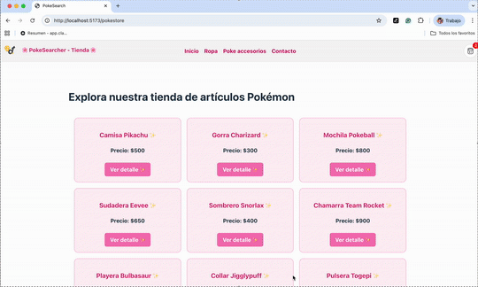

# 🌸 PokéStore UwU 🌸

Bienvenid@ a **PokéStore**, una tiendita kawaii donde puedes navegar entre productos Pokémon ✨.  
Este proyecto fue hecho con **React + React Router** como parte de la entrega _Navega las rutas_.

---

## 🚀 Funcionalidades

- 🏠 Vista de catálogo completo con todos los productos.
- 🧥 Catálogo filtrado por categorías (ropa, accesorios, etc).
- 🔍 Vista en detalle de cada producto.
- ➕ Contador `ItemCount` para agregar unidades al carrito.
- 🎀 Navegación entre páginas usando **React Router**.
- ⚡ Datos simulados con **Promises + setTimeout** para imitar un fetch.
- ❌ Página 404 para rutas inexistentes.

---

## 📂 Estructura del proyecto

src/
├── components/
│ ├── NavBar.jsx
│ ├── CartWidget.jsx
│ ├── ItemListContainer.jsx
│ ├── ItemList.jsx
│ ├── Item.jsx
│ ├── ItemDetailContainer.jsx
│ ├── ItemDetail.jsx
│ └── ItemCount.jsx
├── data/
│ └── products.js
├── App.jsx
├── main.jsx
└── index.css

---

## 🌸 Capturas / Demo

✨ GIF



---

## 💻 Instalación y uso

1. Clonar el repo:

   ```bash
   git clone https://github.com/anherika/pokestore.git

   ```

2. Instalar dependencias

````bash
npm install

3. Correr el proyecto:
```bash
npm run dev


---

🛍️ Productos disponibles

Ejemplo de lo que encontrarás en la tiendita:

Camisa Pikachu ✨

Gorra Charizard 🔥

Mochila Pokeball 🎒

Sudadera Eevee 🦊

Sombrero Snorlax 💤

...y más sorpresitas kawaii uwu 💖


🌟 Créditos

Proyecto hecho con mucho amor ✨
Estudiante: Angelica Tenorio Vazquez

Para Coder House
````
